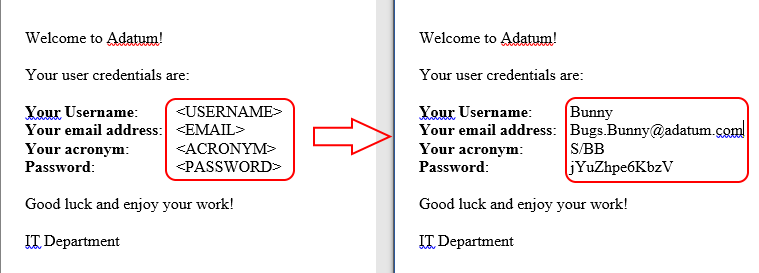

# New-ITUser
User account creation in AD/Exchange2013/Lync2013

## Script in action

## Script steps

- Opens a source XML file and parses the contents
- Generates a unique username based on Firstname and Lastname
- Generates a random password for Active Directory account
- Creates the Active Directory account
- Creates the Home folder
- Adds default group memberships based on the AD user template
- Creates Exchange 2013 mailbox
- Creates Skype for Business (Lync 2013) account
- Creates the Archive drive (additional personalized network storage)
- Creates .docx document with credentials for the user based on template (example below)

## Requirements
- Remote Server Administration Tools
- <a href=https://github.com/EvotecIT/PSWriteWord>PSWriteWord</a> module

## Version
- 0.3 Initial published version
